# 📦 C.S.A.B.A - Central Storage And Business Application

> **Otthoni Tárgyi Nyilvántartó Rendszer** - Egy modern, játékos dizájnú webalkalmazás a háztartási tárgyak nyilvántartására.


## 🎮 Előnézet

Az alkalmazás két különböző dizájnnal rendelkezik:
- **Game UI** - Játékos, színes dizájn vastag keretekkel és emoji ikonokkal
- **Retro UI** - Klasszikus, letisztult megjelenés

### 🖥️ Desktop nézet

| Game UI | Retro Design |
|---------|--------------|
| 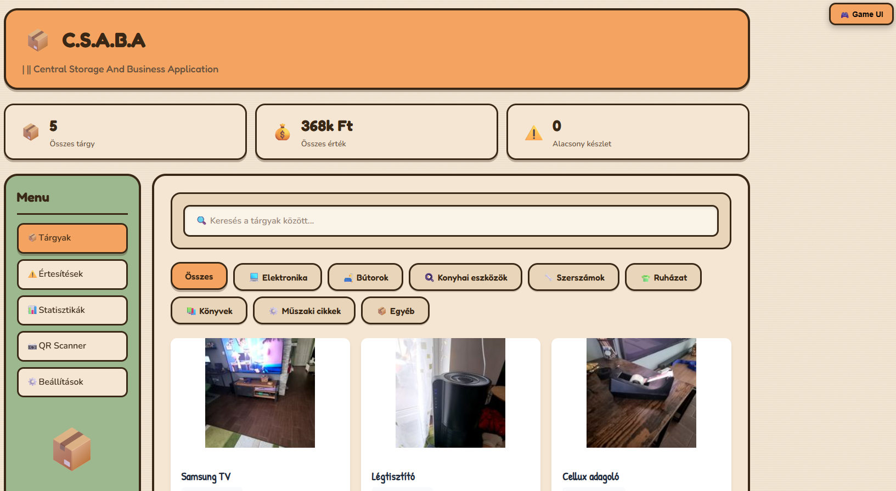 | 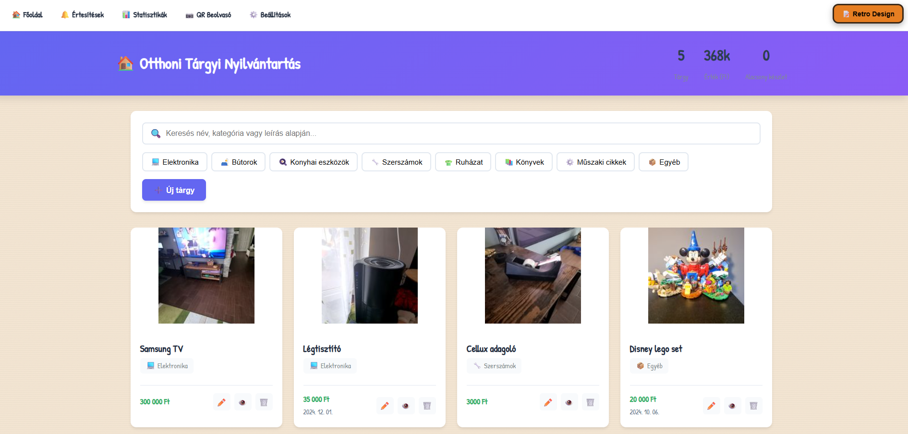 |

### 📱 Mobil nézet - Game UI

| Főoldal | Értesítések | Statisztikák |
|---------|-------------|--------------|
| 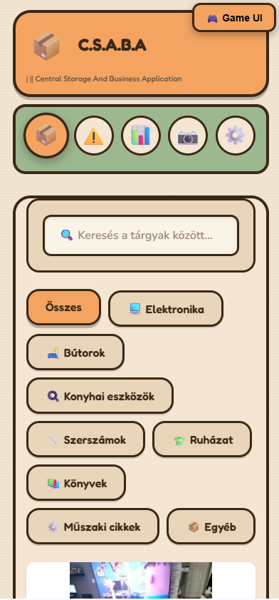 | 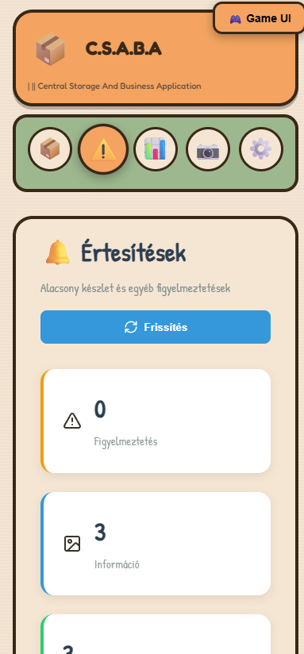 | 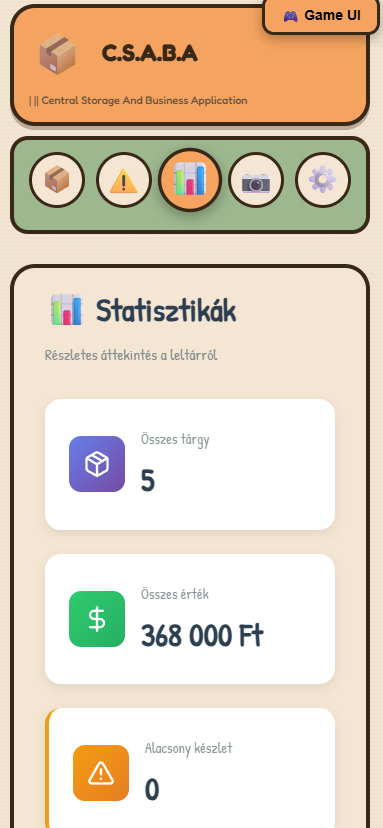 |

| Statisztikák (2) | QR Scanner | Beállítások |
|-----------------|------------|-------------|
| 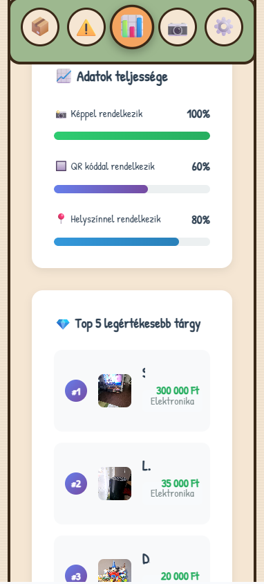 | 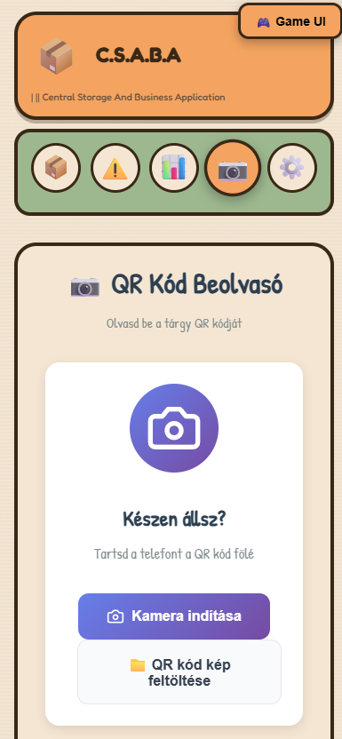 | 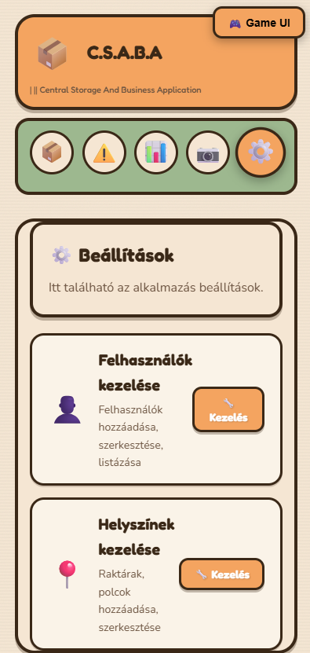 |

| Előnézet |
|----------|
| 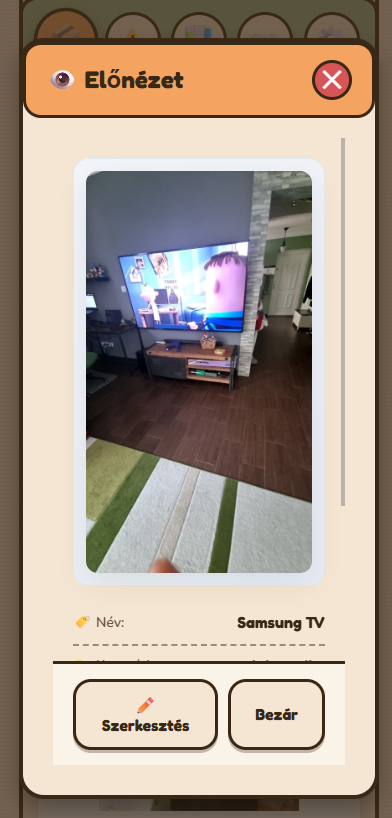 |

### 📱 Mobil nézet - Retro Design

| Főoldal | Értesítések | Statisztikák |
|---------|-------------|--------------|
| 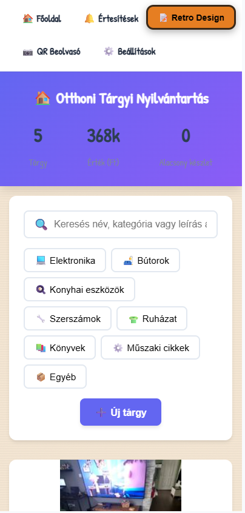 |  | 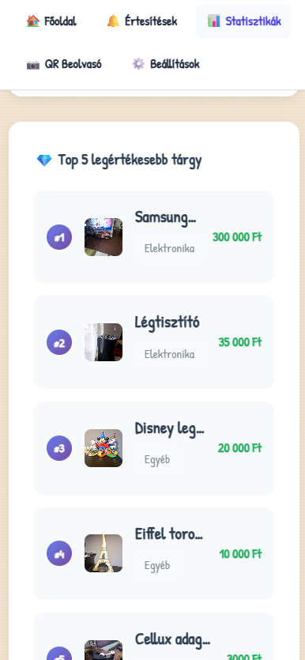 |

| QR Scanner | Beállítások | Előnézet |
|------------|-------------|----------|
| 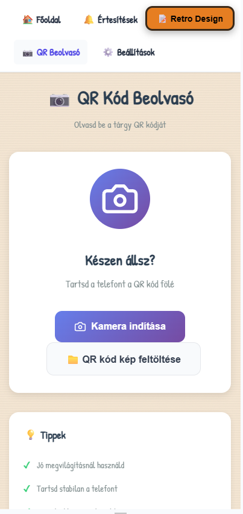 | 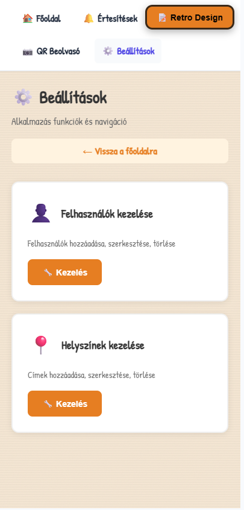 | 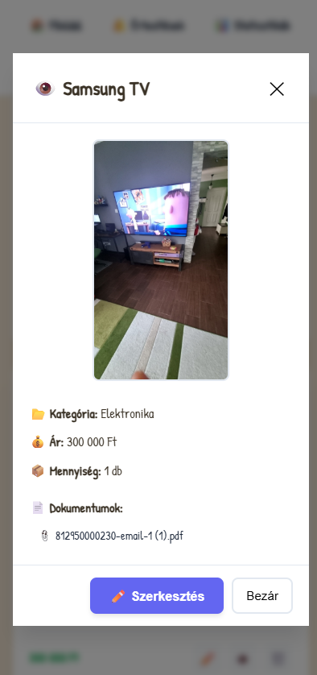 |

### 📲 Tablet nézet

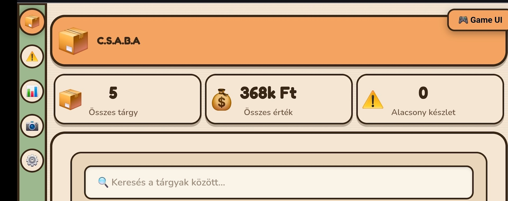

## ✨ Funkciók

### 📱 Tárgykezelés
- ✅ Tárgyak hozzáadása, szerkesztése, törlése
- ✅ Több kép feltöltése tárgyankét (kamera + galéria)
- ✅ Dokumentumok csatolása (számla, garancia, kézikönyv)
- ✅ QR kód generálás és beolvasás
- ✅ Kategorizálás és keresés
- ✅ Helyszín kezelés (hierarchikus)

### 📊 Statisztikák
- ✅ Összes tárgy és érték áttekintés
- ✅ Kategória szerinti bontás
- ✅ Top 5 legértékesebb tárgy (kattintható!)
- ✅ Havi vásárlási trend
- ✅ Adatok teljességének mutatói

### 🔔 Értesítések
- ✅ Alacsony készlet figyelmeztetés
- ✅ Kép nélküli tárgyak
- ✅ Helyszín nélküli tárgyak
- ✅ Érintett tárgyak listája modal ablakban

### 📷 Kamera támogatás
- ✅ Mobilon kamerával fotózás
- ✅ HTTPS támogatás a biztonságos kamera hozzáféréshez
- ✅ Képek automatikus mentése

### 🎨 UI/UX
- ✅ Reszponzív dizájn (mobil, tablet, desktop)
- ✅ Landscape mód támogatás
- ✅ Sticky menü görgetéskor
- ✅ Smooth animációk
- ✅ Két választható téma (Game UI / Retro)

## 🛠️ Technológiák

### Backend
- **FastAPI** - Modern, gyors Python web framework
- **SQLAlchemy** - ORM adatbázis kezelés
- **SQLite** - Könnyűsúlyú adatbázis
- **Pillow** - Képfeldolgozás
- **Python-QRCode** - QR kód generálás

### Frontend
- **React 18** - UI komponensek
- **React Router** - Navigáció
- **Axios** - HTTP kérések
- **Lucide React** - Ikonok
- **React Hot Toast** - Értesítések
- **Vite** - Build tool

## 🚀 Telepítés

### Előfeltételek
- Python 3.10+
- Node.js 18+
- Git

### 1. Repository klónozása
```bash
git clone https://github.com/YOUR_USERNAME/home-inventory-system.git
cd home-inventory-system
```

### 2. Backend telepítése
```bash
cd backend
python -m venv venv

# Windows
venv\Scripts\activate

# Linux/Mac
source venv/bin/activate

pip install -r requirements.txt
```

### 3. Frontend telepítése
```bash
cd frontend
npm install
```

### 4. Indítás

#### Egyszerű indítás (HTTP)
```bash
# Windows - projekt gyökérben
START-ALL.bat
```

#### HTTPS indítás (kamera támogatáshoz)
```bash
# Windows - projekt gyökérben
START-ALL-HTTPS.bat
```

#### Manuális indítás
```bash
# Backend (külön terminálban)
cd backend
python -m uvicorn app.main:app --reload --host 0.0.0.0 --port 8000

# Frontend (külön terminálban)
cd frontend
npm run dev
```

## 📱 Hozzáférés

- **Lokális:** http://localhost:3000
- **Hálózati:** http://YOUR_IP:3000
- **HTTPS:** https://YOUR_IP:3000 (kamera használatához)

## 📁 Projekt struktúra

```
home-inventory-system/
├── backend/
│   ├── app/
│   │   ├── __init__.py
│   │   ├── main.py          # FastAPI alkalmazás
│   │   ├── models.py        # SQLAlchemy modellek
│   │   ├── schemas.py       # Pydantic sémák
│   │   ├── crud.py          # Adatbázis műveletek
│   │   ├── database.py      # DB konfiguráció
│   │   ├── routes/          # API végpontok
│   │   └── utils/           # Segédfüggvények
│   ├── uploads/             # Feltöltött képek
│   ├── documents/           # Feltöltött dokumentumok
│   └── requirements.txt
│
├── frontend/
│   ├── src/
│   │   ├── components/      # React komponensek
│   │   ├── services/        # API szolgáltatások
│   │   ├── styles/          # CSS fájlok
│   │   ├── App.jsx          # Retro UI
│   │   ├── App-game-ui.jsx  # Game UI
│   │   └── main.jsx         # Belépési pont
│   ├── certs/               # SSL tanúsítványok
│   └── package.json
│
├── START-ALL.bat            # HTTP indító
├── START-ALL-HTTPS.bat      # HTTPS indító
└── README.md
```

## 🔧 Konfiguráció

### Környezeti változók

```env
# Backend (.env - opcionális)
DATABASE_URL=sqlite:///./inventory.db

# Frontend (vite.config.js)
# Az API automatikusan proxy-zva van /api útvonalra
```

### HTTPS beállítás

A kamera funkcióhoz HTTPS szükséges. A `frontend/certs/` mappában:
- `cert.pem` - SSL tanúsítvány
- `key.pem` - Privát kulcs

Generálás Git Bash-sel:
```bash
cd frontend
bash generate-cert.sh
```

## 📝 API Dokumentáció

A backend API dokumentációja elérhető:
- **Swagger UI:** http://localhost:8000/docs
- **ReDoc:** http://localhost:8000/redoc

### Főbb végpontok

| Metódus | Útvonal | Leírás |
|---------|---------|--------|
| GET | /api/items | Összes tárgy |
| POST | /api/items | Új tárgy |
| GET | /api/items/{id} | Egy tárgy |
| PUT | /api/items/{id} | Tárgy módosítás |
| DELETE | /api/items/{id} | Tárgy törlés |
| POST | /api/items/{id}/images | Kép feltöltés |
| GET | /api/categories | Kategóriák |
| GET | /api/notifications | Értesítések |
| GET | /api/stats/dashboard | Statisztikák |

## 🤝 Közreműködés

1. Fork-old a repot
2. Hozz létre egy feature branch-et (`git checkout -b feature/amazing-feature`)
3. Commit-old a változtatásokat (`git commit -m 'Add amazing feature'`)
4. Push-old a branch-et (`git push origin feature/amazing-feature`)
5. Nyiss egy Pull Request-et

## 📄 Licensz

MIT License - lásd a [LICENSE](LICENSE) fájlt.

## 👨‍💻 Készítők

- **Frontend:** Sarah Kim (AI Assistant)
- **Backend:** Maria Rodriguez (AI Assistant)
- **Design:** Claude AI

---

<p align="center">
  Made with ❤️ in Hungary 🇭🇺
</p>
